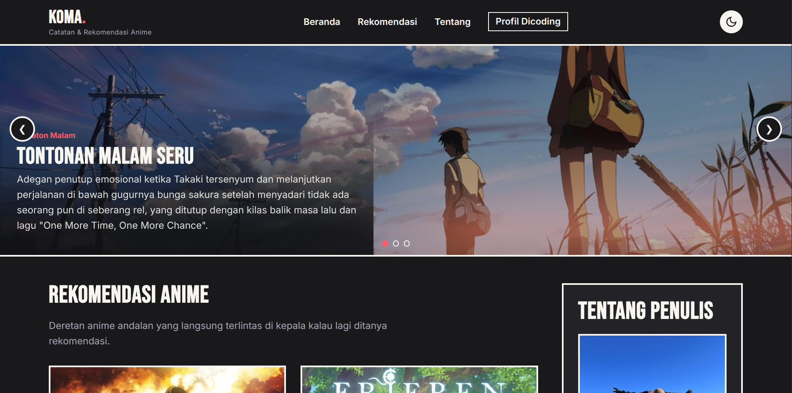
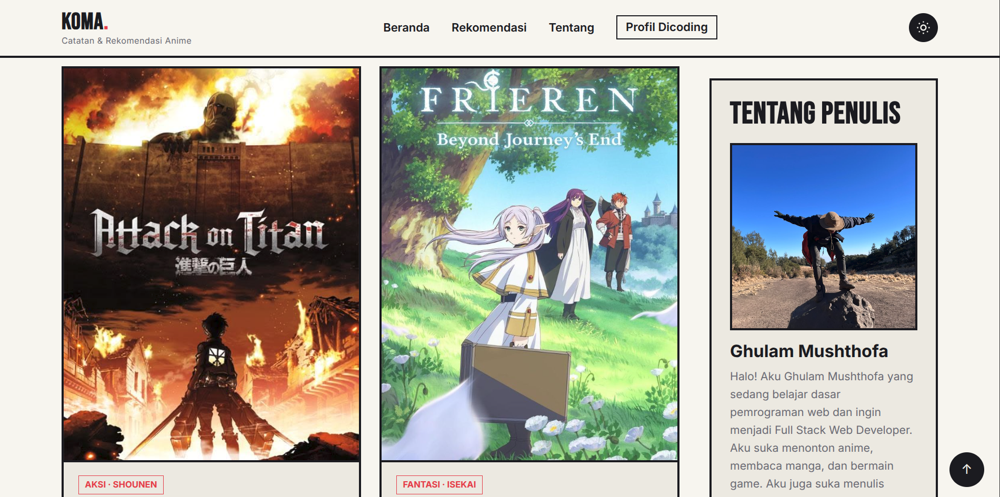
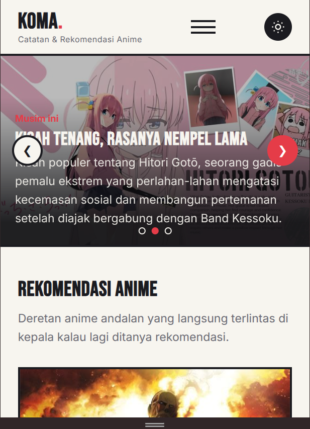

# KOMA. — Anime Notes & Recommendations

> Final Project Submission — Basic Web Programming Course, Dicoding Indonesia

## About the Project

**KOMA** is a single-page static website featuring personal anime notes and recommendations. The name is derived from the Japanese word **koma (コマ)**, which means "panel" — the term used for a single frame or box in manga.

This concept serves as the foundation for the site's overall visual direction: thick borders, halftone textures, and a black-ink & red duotone color palette, moving away from generic pastel or gradient anime aesthetic templates.

This project was built purely with **vanilla HTML, CSS, and JavaScript** without any external frameworks or libraries (no Bootstrap, Tailwind, etc.), adhering to the submission guidelines.

## Features

### Submission Requirements Checklist

* \[x\] Includes `<header>`, `<nav>`, `<footer>`, `<main>`, `<article>` (×4), and `<aside>` elements in `index.html`

* \[x\] `<nav>` contains an `<a>` tag linking to the author's Dicoding profile

* \[x\] `<aside>` displays an author photo (currently a placeholder — see Pre-submission Checklist)

* \[x\] Layout structured using **Flexbox**, with zero floats

* \[x\] Custom theme → "KOMA" manga panel aesthetic

### 🎯 JavaScript Features

All custom-written with **vanilla JS** (`js/script.js`), directly manipulating the DOM:

| Feature | Description | 
 | ----- | ----- | 
| **Hamburger menu** | Opens/closes navigation on smaller screens, complete with `aria-expanded` attributes | 
| **Dark / Light mode** | Theme toggle using `data-theme`, with user preference stored in `localStorage` to persist across reloads | 
| **Image slider** | Auto-slides every 5 seconds + manual navigation buttons & dot indicators, auto-pauses on hover | 
| **Scroll to top** | Floating button appears after scrolling past 420px; clicking smoothly scrolls back to top | 
| **Scroll reveal** | Anime recommendation cards fade in smoothly using `IntersectionObserver` | 

## Design Concept

### Color Tokens

| Token | Light Value | Dark Value | Role | 
 | ----- | ----- | ----- | ----- | 
| `--color-ink` | `#14141A` | Light | Primary text & border color | 
| `--color-paper` | `#F7F5F0` | Dark | Primary background color | 
| `--color-paper-alt` | `#EDEAE2` | Dark Alt | Panel/card background | 
| `--color-accent` | `#E63946` | `#FF5C6A` | Single accent — buttons, tags, hover states | 
| `--color-muted` | `#6B6B75` | Muted Light | Secondary text | 

> In dark mode, these tokens invert (`--color-ink` becomes light, `--color-paper` becomes dark, and the accent color is brightened to `#FF5C6A` to maintain high contrast).

### Typography

Utilizes two fonts from **Google Fonts**:

* **Bebas Neue** — "KOMA." logotype and large hero headings, delivering a bold manga-title impression

* **Inter** — all body text, ensuring high legibility across small screens

### Visual Elements

* Bold **3px** borders (moving away from soft SaaS-style card shadows)

* **Halftone** dot pattern textures in decorative areas

* Subtle scroll-triggered **reveal** animations — kept clean and non-distracting

## Tech Stack

* **HTML5** — semantic markup

* **CSS3** — custom properties, Flexbox, `clamp()`, media queries, `prefers-reduced-motion`

* **JavaScript (ES6+)** — zero external dependencies

* **Google Fonts** — Bebas Neue & Inter